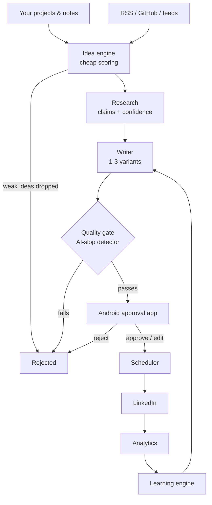
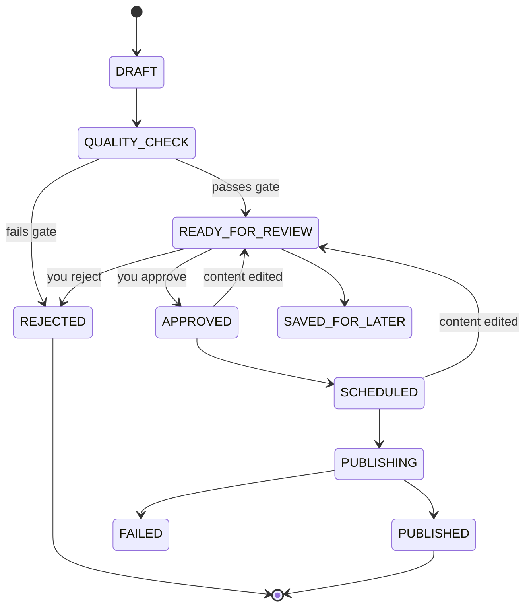

# Linkdin-Bot — LinkedIn Content Copilot

A personal LinkedIn content system: it finds ideas from sources you choose,
researches them, writes drafts, refuses to show you the bad ones, and sends
the survivors to an Android app where **you** approve, edit or reject them.
Only then does anything get scheduled.

It is built to be the opposite of a content-spam bot.



---

## What makes it different

**It rejects its own work.** A dedicated quality gate scores every draft for
specificity, originality, technical depth and AI-writing tells. Drafts that
fail never reach your phone. Measured against real examples: an AI-slop post
("AI isn't coming. It's already here. Here are 7 things you MUST know") scores
16/100 and is rejected; a genuine build log scores 85 and passes; bland
corporate filler scores 46 and is held back even though it contains no obvious
slop markers.

**You cannot approve one post and publish another.** Every approval is bound
to a SHA-256 hash of the exact text you saw. Any later edit invalidates the
approval, cancels the schedule, and sends the post back for review.

**It learns from what you actually do** — what you delete, rewrite, shorten
and reject — not from what you say you like.

**It never claims certainty it doesn't have.** The learning engine labels every
finding `INSUFFICIENT_DATA`, `EARLY_SIGNAL`, `MODERATE_CONFIDENCE` or
`STRONG_SIGNAL` and prints the sample size. Metrics that were never collected
render as `—`, never `0`.

---

## Safety boundaries

These are design constraints, not settings:

| The system will | The system will never |
|---|---|
| Discover ideas from feeds you configure | Scrape LinkedIn or anything behind a login |
| Draft posts and connection notes | Send a connection request, DM, comment or like |
| Schedule content **you approved** | Publish anything you have not approved |
| Publish via the official LinkedIn API, if you configure it | Drive a browser, spoof a fingerprint, or evade bot detection |
| Recommend people worth knowing | Do anything in bulk |

For networking the flow ends at your thumb:

```
Discover person → score → show reason + draft note → you open LinkedIn → you connect
```

There is no code path that sends an invitation. `tests/test_safety_boundaries.py`
asserts this against the live API surface.

For publishing, the default mode is `manual`: at the scheduled time the backend
prepares copy-ready text and reminds you, and you post it. If you configure the
official LinkedIn API it will publish directly. If that fails, the post is
marked FAILED and you are told — it never silently falls back to something
riskier.

---

## Architecture

```
backend/app/
  api/v1/        32 endpoints, OpenAPI documented at /docs
  agents/        discovery · research · writer · fact_checker · quality · analytics
  approvals/     state machine + content-hash integrity
  scheduler/     posting slots, timezone-aware
  jobs/          durable queue: retries, backoff, idempotency
  llm/           provider abstraction (mock · Claude · OpenAI-compatible)
  linkedin/      publisher abstraction (manual · official API)
  networking/    recommendations, no send capability
  database/      18 tables + ordered migrations
mobile/          Kotlin + Jetpack Compose app
```

**Draft lifecycle** — transitions are validated server-side and nowhere else:



`REJECTED` and `CANCELLED` are terminal: a rejected draft can never be
published. Regenerating after a rejection creates a new draft that must earn
its own approval.

---

## Setup

Requirements: Python 3.11+, and (for the app) JDK 17 or 21 and the Android SDK.

```bash
git clone https://github.com/Arjun-Chandra-7/Linkdin-Bot.git
cd Linkdin-Bot
cp .env.example .env          # defaults are safe: offline mock LLM, manual publishing
./scripts/dev.sh              # creates the venv, installs deps, starts the backend
```

The backend listens on `0.0.0.0:8000` so your phone can reach it. API docs at
`http://localhost:8000/docs`.

Then seed some sources and start the daily loop:

```bash
python scripts/seed.py --github your-name/your-repo
```

Your own repository matters most: commits and releases are a factual record of
what you actually built, which is what the account is supposed to be about.

It runs with **no API key**: the default LLM provider is a deterministic
offline mock that produces real, topic-specific drafts, so you can exercise the
whole pipeline before spending anything.

### Environment variables

| Variable | Default | Notes |
|---|---|---|
| `SECRET_KEY` | dev placeholder | Generate one; the server refuses to run in production with the default |
| `LLM_PROVIDER` | `mock` | `mock` · `anthropic` · `openai` |
| `ANTHROPIC_API_KEY` | – | Required for `anthropic` |
| `ANTHROPIC_MODEL` | `claude-opus-5` | |
| `LINKEDIN_PUBLISH_MODE` | `manual` | `manual` · `api` |
| `LINKEDIN_ACCESS_TOKEN` | – | Member token with `w_member_social`, for `api` mode |
| `LINKEDIN_AUTHOR_URN` | – | e.g. `urn:li:person:XXXX` |

Everything you'd change day to day — posting days and times, timezone, content
mix, quality thresholds, cost limits — lives in the database and is editable
from the app, not in `.env`.

### Pair your phone

```bash
python scripts/pair.py
```

Prints your LAN address, a one-time code (valid 10 minutes) and a QR code.
Enter them in the app. The code is generated **on the laptop and never served
over the network**, so being on your Wi-Fi is not enough to pair.

### Build the APK

```bash
./scripts/build-mobile.sh
# → mobile/app/build/outputs/apk/debug/app-debug.apk
```

Install it over USB, or copy it to the phone (KDE Connect, USB) and tap it:

```bash
adb devices
adb install -r mobile/app/build/outputs/apk/debug/app-debug.apk
```

No Play Store account needed. You may need to allow installing from unknown
sources.

---

## Daily use

The backend runs a discovery pass on a schedule: it checks your sources, scores
candidates for free, researches only the strongest, drafts only the best of
those, and pushes what survives the quality gate to your phone.

A real run against live feeds and a GitHub repo, with the offline mock writer:

```
49 ideas ingested from sources
   ↓  scored in pure Python, no model calls
 6 rejected as too weak (free)
   ↓
 5 researched      ← only these cost anything
   ↓
 5 drafted
   ↓  quality gate
 3 rejected (scored 66-68, below the threshold)
   ↓
 2 reached the approval queue (74 and 84)
```

More ideas than drafts, more drafts than recommendations. That is the point. You open the
app, read, edit if you want, and approve. Everything else is automatic.

You can also just type an idea yourself — Approvals → add a note — which is the
highest-value source there is, since it is first-hand.

---

## Development

```bash
./scripts/dev.sh              # run the backend
./scripts/test.sh             # run the test suite
./scripts/build-mobile.sh     # build the APK
python scripts/e2e_check.py --base http://127.0.0.1:8000   # full acceptance run
```

`e2e_check.py` walks the entire product flow against a running backend and
asserts the safety properties — stale-hash approval refused, offline replay
recorded once, no bulk endpoints, unmeasured metrics left null.

---

## Troubleshooting

**"Backend offline" in the app** — the laptop is asleep, on a different
network, or the backend isn't running. The app keeps working from its cache and
queues your decisions until it reconnects.

**Pairing fails** — codes expire after 10 minutes and work once. Run
`scripts/pair.py` again. Check the phone is on the same Wi-Fi and the address
matches what the script printed.

**The app can't reach the backend** — start it with `./scripts/dev.sh` (binds
`0.0.0.0`), not `--local`. Cleartext HTTP is only permitted to private LAN
addresses, by design.

**Nothing appears in Approvals** — that is often correct: drafts below the
quality threshold are rejected server-side. Lower `quality_threshold` in
Settings, or add your own note to draft from.

**APK build fails** — the Android Gradle Plugin needs JDK 17 or 21. Set
`JAVA_HOME` accordingly; `build-mobile.sh` tries to find a suitable JDK itself.

---

## Status

| Component | State |
|---|---|
| Backend, approval integrity, scheduler, jobs | **Tested** — 69 tests, plus a full HTTP acceptance run |
| Quality gate / AI-slop detector | **Tested** against real slop / real writing / bland filler |
| Discovery → research → draft pipeline | **Tested** on live feeds and a real GitHub repo |
| Android app | **Tested on a device** — installed and driven on Android 14 |
| Offline approval queue | Implemented; the idempotency and stale-hash paths are tested server-side |
| Learning engine | **Tested**; says nothing until it has ≥4 posts with metrics |
| Manual publishing | **Tested** end to end, including the reminder and confirmation |
| LinkedIn API publishing | Implemented, **not configured** — needs your token, and has not been exercised against the live API |
| Push notifications | **Not implemented as push.** The app polls and raises local notifications; there is no cloud service |

Verified on an Android 14 emulator against a live backend: paired over the
network, loaded the approval queue, opened a draft (three variants, quality 71),
and approved it — the server recorded the approval bound to the displayed
content hash and scheduled the post into the next configured slot.

See `docs/` for details.
