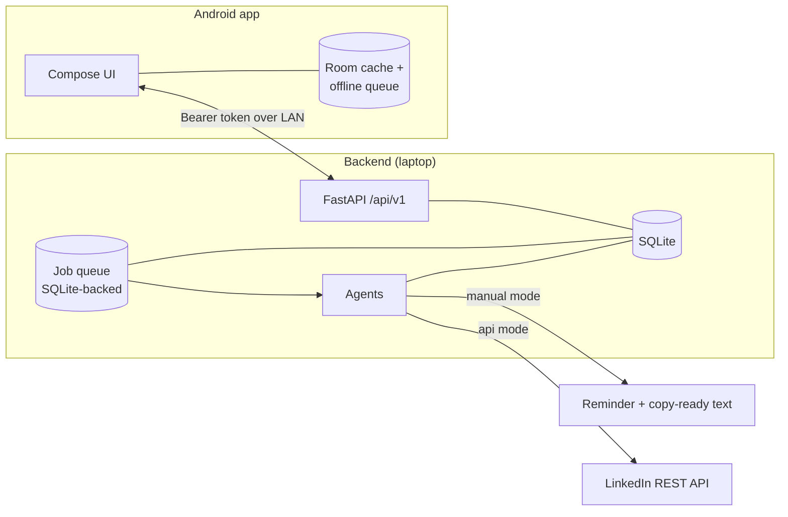

# Architecture

## Why it is shaped this way

The system exists to solve one problem: producing LinkedIn content that is
worth reading, without the author having to sit at a laptop, and without ever
publishing something they did not agree to.

That produces three hard constraints, and most of the design follows from them:

1. **The human approval must be unforgeable.** Everything about drafts,
   versions and scheduling is arranged so that consent binds to exact bytes.
2. **Quality must be enforced by the machine.** If the user has to filter the
   output, the system has moved work rather than removed it.
3. **It must be safe to leave running.** No action that could damage the user's
   account or reputation happens without them.

## Components

## The approval integrity model

This is the part most worth understanding.

A `Draft` never holds text. Text lives in `DraftVersion` rows, which are
append-only — an edit creates a new version rather than mutating one. Each
version stores `content_hash`, the SHA-256 of its canonicalised text.

An `Approval` stores `approved_content_hash`. Publishing requires that:

- the draft is not rejected or cancelled, and
- `sha256(current_version.content)` still equals `current_version.content_hash`
  (catching out-of-band tampering with the database), and
- a *valid* approval exists whose `approved_content_hash` equals that hash.

Any content change calls `invalidate_approvals`, which voids outstanding
approvals, cancels pending scheduled posts, and moves the draft back to
`READY_FOR_REVIEW`.

Consent binds to **bytes, not row ids**. If a regeneration happens to produce
byte-identical text, the approval still stands — the user would be re-approving
something they already read. Canonicalisation absorbs cosmetic whitespace, so
a trailing space typed on the phone does not invalidate consent, but any real
wording change does.

The phone sends `expected_content_hash` — the hash of what was on screen — with
every decision. If the server has moved on, the approval is refused with a 409
rather than applied to text the user never saw. This is what makes an offline
approval queue safe to replay hours later.

## Idempotency

Three separate layers, because publishing twice is the worst failure mode:

| Layer | Key | Prevents |
|---|---|---|
| `Approval.client_action_id` | generated on tap | The same tap recording two approvals after a retry |
| `ScheduledPost.idempotency_key` | derived from approved content hash | The same content being scheduled twice |
| `Job.idempotency_key` | derived from the slot | The same publish job being queued twice |

Plus a unique constraint on `published_posts.draft_id`, and an early return in
`publish_post` when the slot is already published.

## Cost control

Ideas are scored by deterministic Python before any model call — a listicle
roundup is discarded for free. Only ideas above the threshold get research,
only the best get drafted, and three variants are generated only for
high-scoring ideas. The quality gate itself is pure Python, so rejecting bad
writing costs nothing.

`MeteredLLM` checks the configured daily and monthly budget before every call
and records model, tokens and estimated cost after it.

## The job system

A database-backed queue rather than Celery/Redis, because the deployment is one
laptop that sleeps. Jobs survive restarts, retry with exponential backoff up to
`max_attempts`, then land in `DEAD` where they are visible rather than lost. On
boot, jobs left `RUNNING` by a crash are requeued.

The daily loop re-arms itself: `daily_loop` enqueues `discover_topics` and
schedules the next `daily_loop`, so there is no external cron.

## What is deliberately absent

- No browser automation of any kind, and no dependency that could enable it.
- No handling of LinkedIn cookies, sessions or credentials.
- No endpoint that sends a connection request, message, like or comment.
- No bulk operations anywhere.
- No fabricated metrics: an uncollected metric is `NULL`, and the UI renders
  it as `—`.

`tests/test_safety_boundaries.py` asserts each of these against the real code
so a later change cannot quietly undo them.
